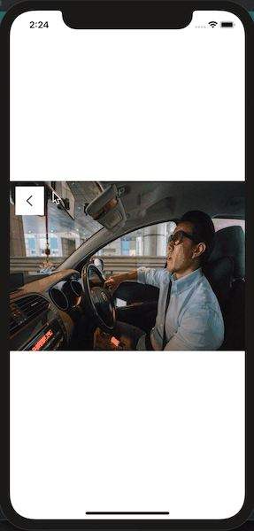

# 让 UIView 像 UINavigationController 一样支持 push 和 pop


`VLog` 这个 App 里，有一个 `UIView` 之间的转场动效做的挺不错，是参照 iOS 系统 `UINavigationController` 的 `push` 和 `pop` 动画，对两个 `UIView` 之间的切换实现了和 系统的 `push、pop` 类似的动效，如下：


iOS 里实现一个这样的动效还是比较容易的，只需要用 `CAAnimation` 的子类 `CATransition` 即可。





## 动画实现原理

- 通过给 view.layer 加自定义的 `CAAnimation`，以替换掉 `[view addSubview:]` 和 `[view removeFromSuperview]` 时的默认动画。
- 按照这个思路，只需要修改这里的 `CATransitionType` 即可实现各种转场动画；
- 更多的 `CATransitionType` 效果示例，可以参见 @青玉伏案 的 [iOS开发之各种动画各种页面切面效果](https://www.cnblogs.com/ludashi/p/4160208.html)


## 参照 UINavigationController 的版本

以上两种实现，其实都没有真正做到像 `UINavigationController` 一样，能随意的 push 和 pop。如果要完全实现一套能像 `UINavigationController` 一样使用的 `UIView`，用法上的限制会增大很多：

首先，假定我们最终的可导航的 UIView 的类为 `UIViewNavigationController`

1、 `UIViewController` 持有一个 `UINavigationController` 类型的属性；
所以，我们就不能直接使用 `UIView`, 而需要封装一个 `UINavigationView`, 持有一个 `UIViewNavigationController` 属性，便于 `UIView` 调用 `[self.navigationView popView]`

2、 `UINavigationController` 是继承自 `UIViewController` 的。
所以，`UINavigationController` 需要继承自 `UIView`, 至少有 `initWithRootView:`, `pushView:(UINavigationView *)view`, `popView` 等接口，内部还需要维护一个 stack，管理一层一层 push 入的 views

3、由于很少有这么复杂的使用场景，这里仅提供简单的 API 接口，需要的可以自行实现

```ObjC
#import <UIKit/UIKit.h>

@class UIViewNavigationController;
@interface UINavigationView : UIView
@property (nonatomic, strong, readonly) UIViewNavigationController *viewNavigation;
@end


@interface UIViewNavigationController : UIView

@property(nonatomic,readonly,strong) UINavigationView *topView; // The top view on the stack.
@property(nonatomic,readonly,strong) UINavigationView *visibleView;
@property(nonatomic,copy) NSArray<__kindof UINavigationView *> *subNavigationViews; // The current navview stack.

- (instancetype)initWithRootView:(UINavigationView *)rootView;
- (void)pushView:(UINavigationView *)view animated:(BOOL)animated;
- (UINavigationView *)popView:(BOOL)animated;
- (NSArray<__kindof UINavigationView *> *)popToView:(UINavigationView *)view animated:(BOOL)animated;
- (NSArray<__kindof UINavigationView *> *)popToRootView:(BOOL)animated;
@end

```

